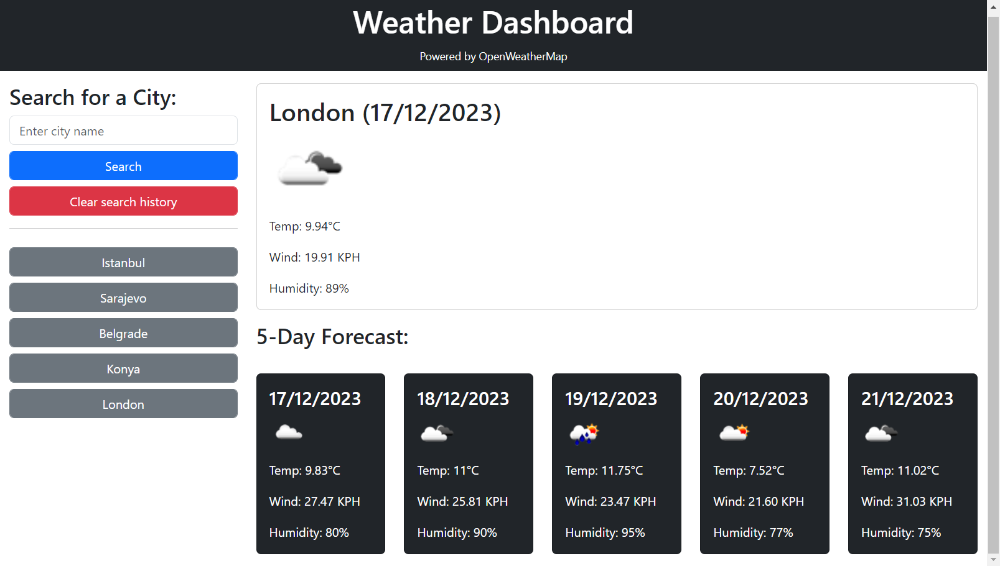

# <Weather-Dashboard>

## Description

This project delivers current and 5-day forecast weather details when users input a city name. It retains previous searches, allowing users to revisit results with a simple click. I utilized API keys to fetch data and employed Bootstrap for an enhanced and stylish user interface, improving my skills in data retrieval and presentation.

## Usage

To initiate a search, users click on the search box labeled 'Enter city name,' input their desired city, and submit. The resulting data is then displayed, mirroring the format shown in the website screenshot below. The 'Clear search history' button allows users to delete their search history at any time. Moreover, for convenience, buttons are provided after each new search, enabling users to easily revisit cities they've searched before. 

## Credits

Weather data provided by [OpenWeather](https://openweathermap.org/)

## Deployment
The deployed website is available at:

[Weather Dashboard](https://cemileblks.github.io/weather-dashboard/)

## License

This project is licensed under the MIT License. Please refer to the LICENSE in the repo.
